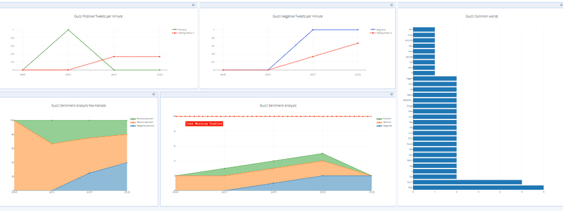

##  Technical Report - Twitter Sentiment Dashboard 

###Directory:

1. README.md 
2. TweepyAdvanced ('./tweepyAdvanced.py')
3. plotly credentials ( )
4. alert_sms 
5. twitter_cred 
6. Slides
7. Link to Dashboard (https://plot.ly/dashboard/ericpmwong:80/present#/)

## Executive Problem
Our evolving social climate has added complexities to brand sentiment. Incidients involving high profile companies have recieved negative backlash for attempt at "positive" marketing campaigns or media messages. Traditional market testing methodologies are rendered less capable of encaspualting the social media's psychological diversity. Despite the large amount of investment in market testing, social platforms such as twitter are proving increasingly impactful and indicative of true underlying seniment.

## Twitter Sentiment Dashboard

"Twitter Sentiment Dashboard" is a realtime comprhensive and KPI indicator with emphasis on Public Relations damage control features. Underlying is an API streaming realtime twitter tweets and classifiying general "sentiment" (positive, negative or neutral). It will return the classified number of tweets as well as relative percentages. In the case of a misleading sentiment detction it includes most common key words which can reveal underlying sentiment negativity. In adddition, text messaging alerts of a potential PR issue. Tweets rolling means, convey a lagged indicator feedback to detect trend reversals of marketing actions.

###### Includes:
* General sentiment compiler
* Realtime list of commonly associated words (In case sentiment analyzer is deceptive)
* Instant Text messaging if negative tweets exceed set tolerance (Notifies 24/7)
* Moving average of average tweet to detect trend reversals (Can reveal success of damage control)
* Absolute number of tweets (Spikes in tweet numbers)
* Normalized percentages

###### Potential Updates:
* Pulls greater than 600 (Plotly unsported)
* Reintialization and re-looping
* Data export to XLS/CSV
* General Sentiment guage

## Citations and Resources:

- [vprusso github](https://github.com/vprusso/youtube_tutorials/tree/master/twitter_python/part_1_streaming_tweets)
- [the-javapocalypse github](https://github.com/the-javapocalypse/Twitter-Sentiment-Analysis)
- [shreyans29 github](https://github.com/shreyans29/thesemicolon)
- [sentdex video tutorial](https://www.youtube.com/watch?v=bz2zqXFjOrE&t=524s) (FYI. some Plotly Stream functions are deprecated)
- [Tweepy](http://www.tweepy.org/)
- [Twilio](https://www.twilio.com/)
- [Plotly Stream](https://plot.ly/python/streaming-tutorial/)
- [Twitter Developer](https://developer.twitter.com/content/developer-twitter/en.html) 
- [TextBlob](https://textblob.readthedocs.io/en/dev/)
- [NLTK](https://www.nltk.org/) 
- [Dash](https://dash.plot.ly/)

## Directory Outline:

1. README.md : Current File

2. tweepyAdvanced.py:
	* Exectuable which enables real time streaming
	* Cannot be executed without main user Plotly Stream credentials (Eric Wong)
	* Several depencies needed: (twittercred, alert_sms, tls.getcredentialsfile (from Plotly Folder))
	* Imports:
		- numpy
		- pandas
		- time
		- datetime
		- tweepy
		- json
		- textblob
		- re 
		- nltk stopwords
		- Counter from collections
		- dash
		- plotly
		- ProtocolError from urllib3.exceptions
		
3. Plotly Credentials ("./plotly/credentials")
	* The following file is required to run the tweepyAdvanced.py
	* Due to security reasons, I cannot release my personal stream APIs
	* You may create your own plotly account and use your own plotly API stream IDs as the tls should import it

4. alert_sms.py
	* File is imported by tweepyAdvanced.py
	* Connects to Twilio API to send text message.
	* Code holds credentials for text messaging notification
	* Appreciate if you do not use my Twilio credentials. Thank you.

5. twitter_cred (removed)
	* Twitter API developer keys listed in tweepyAdvanced.py
	* Left for future to keep credentials seperate from main tweepy_Advanced.py

6. Slides
	* Slides entailing executive summary and details of dashboard and methodology

7. [Dashboard](https://plot.ly/dashboard/ericpmwong:80/present#/)
	* Link to Dashboard
	* Dashboard is inactive until tweepyAdvanced.py is exectued
	* If tweepyAdvanced is not executing, Dashboard will display last fetched data (Not realtime)